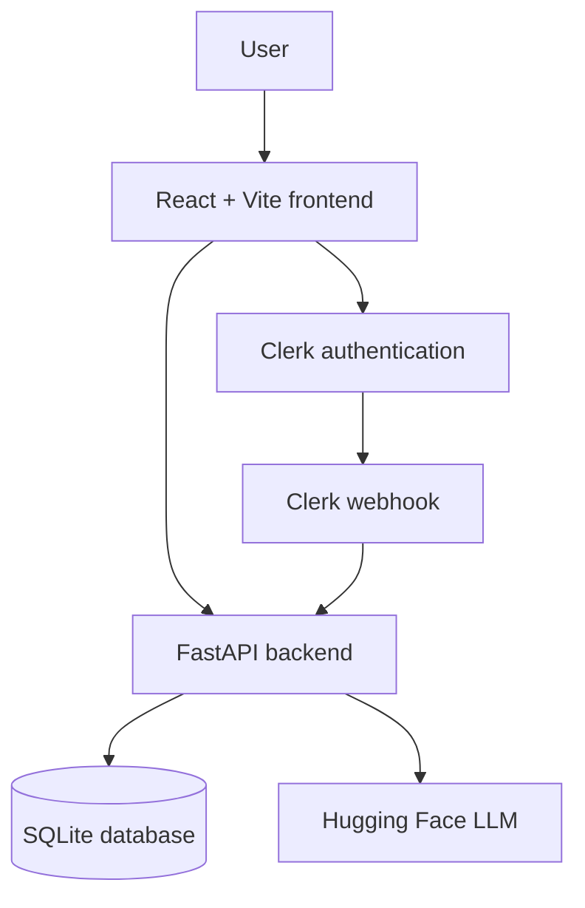

# Architecture

CodePrep.AI is a full-stack coding interview practice app with a React frontend, FastAPI backend, Clerk authentication, SQLite persistence, and Hugging Face challenge generation.

## System Overview

## Runtime Flow

1. The user signs in through Clerk.
2. The React app requests a Clerk token and calls the FastAPI backend.
3. The backend verifies the request through Clerk.
4. The quota service checks whether the user has daily challenge capacity.
5. The LLM generator creates a multiple-choice challenge for the selected difficulty.
6. SQLAlchemy stores the generated challenge and updates the user's quota.
7. The frontend renders the challenge, explanation, and history views.

## Backend Structure

- `backend/server.py`: local Uvicorn entrypoint.
- `backend/src/app.py`: FastAPI app, CORS configuration, health check, and router registration.
- `backend/src/ai_generator.py`: Hugging Face model loading and challenge generation.
- `backend/src/database/`: SQLAlchemy models and persistence helpers.
- `backend/src/routes/challenge.py`: challenge generation, quota, and history endpoints.
- `backend/src/routes/webhooks.py`: Clerk webhook handler for user provisioning.
- `backend/src/utils.py`: Clerk authentication helper.

## Frontend Structure

- `frontend/src/auth/`: Clerk provider and auth page.
- `frontend/src/challenge/`: challenge generation and multiple-choice UI.
- `frontend/src/history/`: challenge history view.
- `frontend/src/layout/`: authenticated app shell and navigation.
- `frontend/src/utils/api.js`: authenticated API client.

## Configuration Boundaries

- `VITE_API_BASE_URL` controls which backend the frontend calls.
- `ALLOWED_ORIGINS` controls FastAPI CORS origins.
- `DATABASE_URL` controls the SQLAlchemy database target.
- `CODEPREP_MODEL_ID` can swap the Hugging Face model without code changes.

## Extension Points

- Add new challenge formats in `backend/src/ai_generator.py` and `frontend/src/challenge/`.
- Add practice modes by extending the challenge request schema and prompt.
- Replace SQLite with Postgres by changing `DATABASE_URL` and running migrations.
- Add deployment by replacing the intentionally absent placeholder CD flow with a concrete provider-specific workflow.
